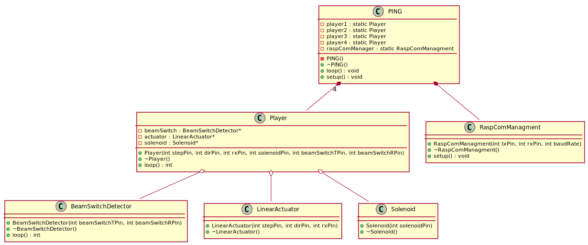

# PING² - Branche de développement ESP32

Cette branche contient le code de développement pour l'ESP32, responsable de la gestion de la plateforme (moteurs, solénoïdes, détection des buts, etc.).

## Fonctionnalités principales

- Gestion des moteurs
- Calibration automatique avec détection de courant et gestion d'accélération
- Détection d'échec des moteurs pas à pas
- Gestion des solénoïdes et protection contre la surchauffe
- Détection des buts et tests d'interruption de faisceau

## Structure du programme embarqué


## Installation et déploiement

1. Cloner le dépôt et se positionner sur la branche `esp32-dev` :
   ```bash
   git checkout esp32-dev
   ```

2. Ouvrir le projet avec PlatformIO dans votre IDE (comme VSCode). Les dépendances devraient être installées automatiquement.

3. Compiler et déployer le code sur l'ESP32.


## Avancement
   - [X] Initialisation du .ini
   - [X] Implémentation du contrôle moteur
   - [ ] Gestion des solénoïdes
   - [X] Détection des buts
   - [X] Calibration automatique
   - [ ] Tests unitaires
